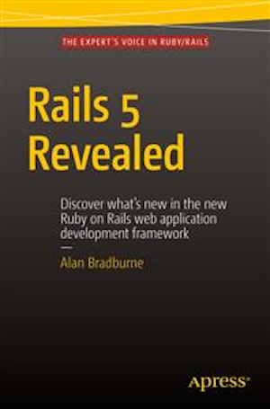

[](https://gitpitch.com/enogrob/ebook-project/master)
```
Roberto Nogueira  
BSd EE, MSd CE
Solution Integrator Experienced - Certified by Ericsson
```
# eBook Rails 5 Revealed



**About**

Learn everything you need to about the subject of this `eBook` project.

[Homepage](http://www.apress.com/us/book/9781484217085)

## Topics
```
[ ] Upgrading to Rails 5
[ ] Changes from Rails 4.2
[ ] Active Record
[ ] Testing
[ ] Rails API
[ ] Action Cable
```
